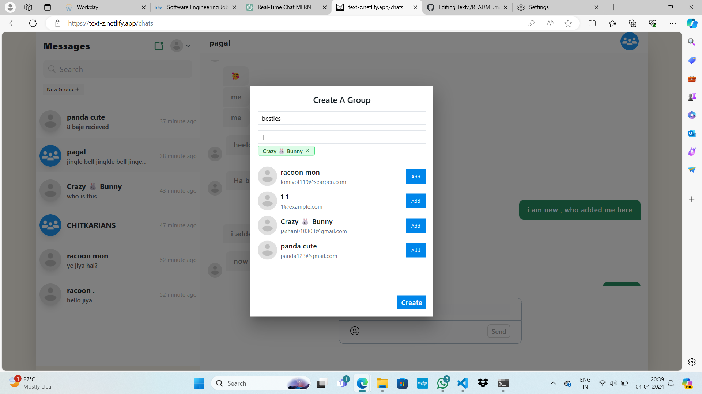

# TextZ - Real-Time Chat Application

TextZ is a real-time chat application developed using the MERN stack (MongoDB, Express.js, React.js, Node.js). It facilitates various functionalities including user authentication, profile management, one-to-one messaging, group chats, and more. This README provides an overview of the project, its features, and how to set it up locally.

## Live Link
Access the live application [here](https://text-z.netlify.app). or type => https://text-z.netlify.app

## Project Dependencies

```
Project Dependencies/
│
├── @reduxjs/toolkit: ^2.2.3
│
├── react-redux: ^9.1.0
│
├── react-toastify: ^10.0.4
│
└── redux: ^5.0.1
```

## Frontend Dependencies
```
Frontend Dependencies/
│
├── @chakra-ui/react: ^2.8.2
│
├── @emoji-mart/data: ^1.1.2
│
├── @emoji-mart/react: ^1.1.1
│
├── @emotion/react: ^11.11.4
│
├── @emotion/styled: ^11.11.0
│
├── @mui/material: ^5.15.12
│
├── @react-oauth/google: ^0.12.1
│
├── @testing-library/jest-dom: ^5.17.0
│
├── @testing-library/react: ^13.4.0
│
├── @testing-library/user-event: ^13.5.0
│
├── axios: ^1.6.7
│
├── emoji-mart: ^5.5.2
│
├── framer-motion: ^11.0.8
│
├── gapi-script: ^1.2.0
│
├── react: ^18.2.0
│
├── react-dom: ^18.2.0
│
├── react-icons: ^5.0.1
│
├── react-loading-skeleton: ^3.4.0
│
├── react-redux: ^9.1.0
│
├── react-router-dom: ^6.22.0
│
├── react-scripts: 5.0.1
│
├── react-scrollable-feed: ^2.0.1
│
├── react-toastify: ^10.0.4
│
├── redux: ^5.0.1
│
├── socket.io-client: ^4.7.4
│
└── web-vitals: ^2.1.4
```

## Backend Dependencies

```
Backend Dependencies/
│
├── bcrypt: ^5.1.1    #it uses c++ for encryption
│
├── bcryptjs: ^2.4.3   #it uses js for encryption
│
├── body-parser: ^1.20.2
│
├── cors: ^2.8.5                  #to allow request from another server
│
├── dotenv: ^16.4.5               # to keep safe file and used in deployment
│
├── express: ^4.18.3              #it is a node framework for short syntax
│
├── google-auth-library: ^9.6.3
│
├── jsonwebtoken: ^9.0.2          #it is a token so that server dont check user always
│
├── mongodb: ^6.4.0
│
├── mongoose: ^8.2.0
│
└── socket.io: ^4.7.4             # for real time use , without this we have to refresh again
```

## Loading


## Login Page


## Signup Page


## Welcome Page


## Search Users


## One to One Chat


## Group Chat


## Create Group


## Edit Group


## Features
- **User Authentication:** Secure registration and login system.
- **Profile Management:** Update profile information, including bio and name.
- **Search Users:** Search for other users by username.
- **Real-Time Messaging:** Utilizes Socket.IO for real-time messaging capabilities.
- **One-to-One Chat:** Engage in private one-to-one chats.
- **Group Chats:** Create groups, add or remove members, change group names.
- **Typing Indicator:** Shows typing indicators in real-time.
- **Error Handling:** Comprehensive error handling mechanisms.

## Project Structure
The project consists of two main directories: `frontend` and `backend`.

### Frontend
- **`frontend`**: Contains the client-side codebase.
  - **`public`**: Static assets and `index.html`.
  - **`src`**: React components, styles, and application logic.
    - **`components`**: Reusable React components.
    - **`pages`**: Components representing different pages (e.g., login, signup, chat).
    - **`services`**: API services for backend communication.
    - **`App.js`**: Main component for routing and rendering.
    - **`index.js`**: Entry point of the React application.

### Backend
- **`backend`**: Houses the server-side codebase.
  - **`database`**: Database connection logic.
  - **`routes`**: API routes for user management, chat functionalities, etc.
  - **`app.js`**: Entry point of the Node.js application, middleware, and route handling.
  - **`models`**: MongoDB schemas for users, chats, messages, etc.

## Getting Started
To run the application locally:
1. Clone the repository from [GitHub](https://github.com/Jashan-panwa/TextZ).
2. Navigate to the project directory.
3. Install dependencies for both frontend and backend.
   ```bash
   # Install frontend dependencies
   cd frontend
   npm install

   # Install backend dependencies
   cd ../backend
   npm install


## Setting up Environment Variables
1. Create a `.env` file in both the frontend and backend directories.
2. Add the necessary environment variables:
   - In the backend `.env` file, include variables such as `DATABASE_URI` and `JWT_SECRET`.
   - In the frontend `.env` file, include variables such as `REACT_APP_API_URL` for the backend API URL.

## Starting the Backend Server
   <pre><code>bash
# Navigate to the backend directory
cd backend

# Start the backend server
npm node app.js
</code></pre>


## Starting the Frontend Development Server
  <pre><code>bash
 # Navigate to the frontend directory
   cd frontend

# Start the frontend development server
   npm start
</code></pre>

## Contributors
- Jiya (ID: 2110990701)
- Jashan (ID: 2110990669)

## Contributing
Contributions are welcome! Feel free to open issues or pull requests on [GitHub](https://github.com/Jashan-panwa/TextZ).

## License
This project is licensed under the MIT License. See the [LICENSE](./LICENSE) file for details.

## Acknowledgments
Special thanks to the developers of the libraries and tools used in this project, including React.js, Node.js, Express.js, MongoDB, and Socket.IO.

